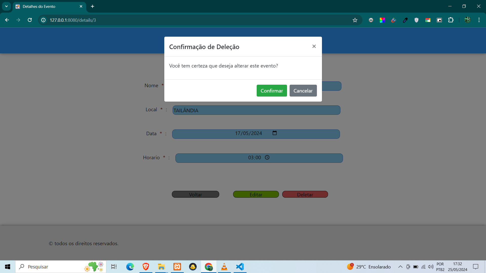

<h1>Agenda de Eventos com Spring Boot</h1>
<h2>Primeiro projeto com Spring Boot</h3>
<h3>Andamento até o momento</h3>
<h4>1.Página de amostra dos eventos cadastrados:</h4>

<h4>2.Janela modal para confirmação ao deletar evento: </h4>

<h4>3.Confirmação de que foi deletado: </h4>

<h4>4.Página para cadastrar um evento: </h4>

<h4>5.Janela modal para confirmar o cadastro do evento: </h4>

<h4>6.Confirmação de cadastro de evento: </h4>

<h4>7.Não deixa adicionar evento em datas que já passaram: </h4>

<h4>8.Tela de Editar evento: </h4>

<h4>9.Modal de confirmar edição das informações do evento: </h4>

